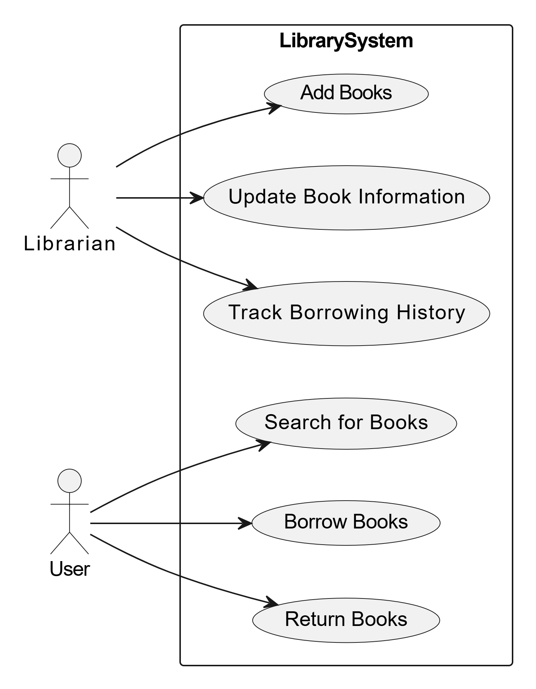
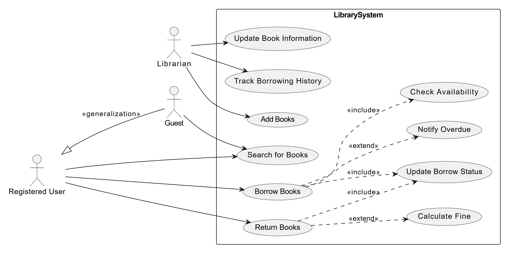
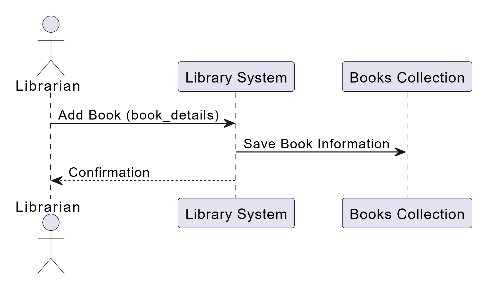
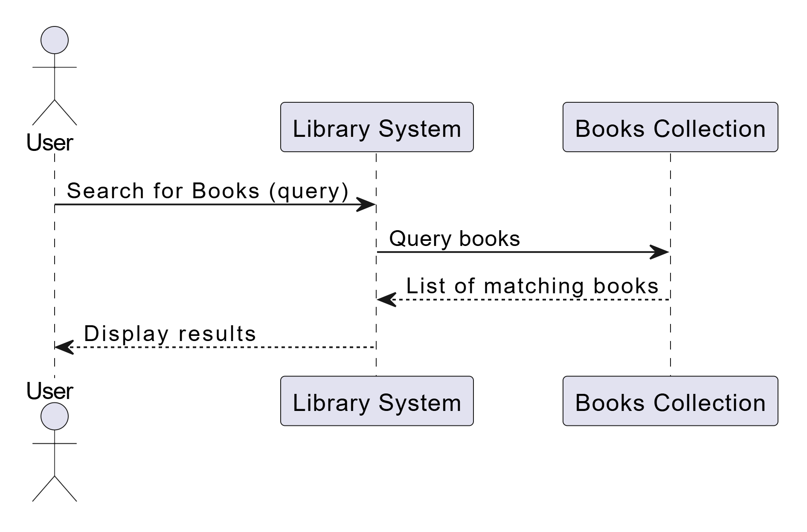
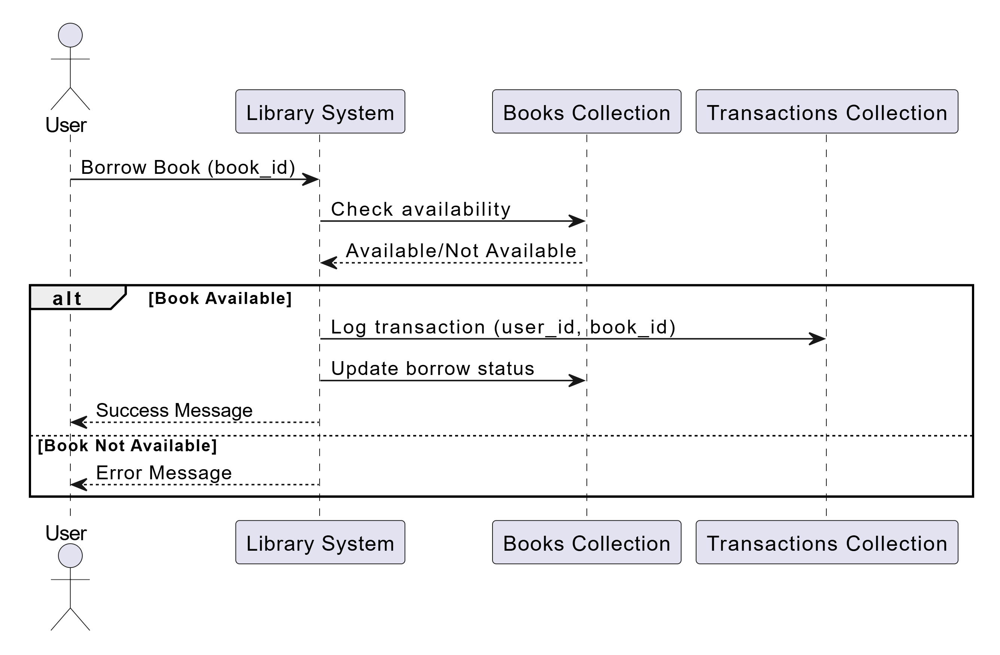
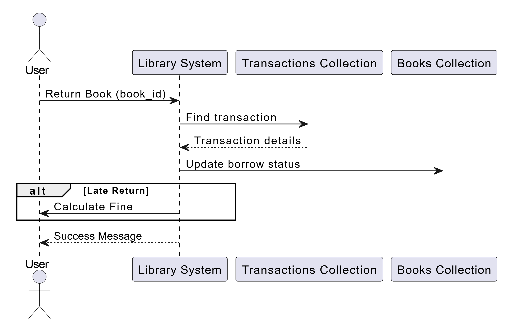
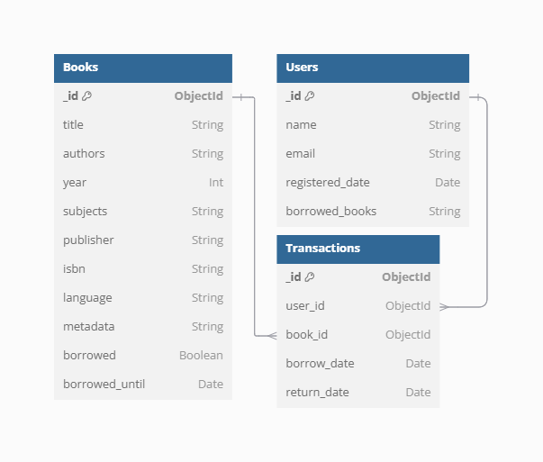

# Bookly online library
Bookly is an online service that allows you to explore 1000+ books from around the world and find out if it's available at your local library to borrow it

> Link to presentation --> [click](https://www.canva.com/design/DAGbgPUi92A/0P_sf_5NmAdq7r_Ww9qbsQ/edit?utm_content=DAGbgPUi92A&utm_campaign=designshare&utm_medium=link2&utm_source=sharebutton)

Information about books is taken from the OpenLibrary API and parsed through a python script
  

## About project
My project focuses on building a comprehensive library management system, implemented using a MongoDB database with three primary collections: books, users, and transactions. The system is designed to streamline library operations, from managing book inventory to tracking user borrowing activities efficiently

The books collection contains rich metadata about each book, ensuring detailed and accurate information for users. The users collection represents the library's members, while the transactions collection logs all borrowing activities

This structure is optimized through indexing for fast data retrieval and includes relationships between collections. The project leverages real-world data scraped from OpenLibrary, populating the database with thousand of entries, making it suitable for testing scalability and query performance in a real environment
  

## UML Use Case
The Use-Case diagram represents the interaction between users (actors) and the system. There are two main actors: the user and the librarian. First, I created a basic diagram where the user can search for a book, borrow, and return it. The librarian can add books, update book information, and track borrowing history. Then I added additional cases with include and exclude relationships and generalization
  

  

## UML Sequence
A Sequence Diagram shows the step-by-step interactions between the system's components and users (actors) for a specific process. I created four main sequence diagrams to represent the general processes: Add, Search, Borrow and Return a book
  

  

## ERD diagram
ERD shows the database structure, including entities, their attributes, and the relationships between them. This helps visualize how data is organized and how tables interact with each other
  
Entities:
- Books: Represents the books in the library with attributes like title, authors, year of publication, etc
- Users: Represents the people using the library, including details like name, email, and registration date
- Transactions: Tracks borrowing and returning of books, linking users to the books they borrow 

Relationships:
- Users and Transactions: A one-to-many relationship. A single user can have multiple transactions (borrow/return multiple books)
- Books and Transactions: A one-to-many relationship. A single book can appear in multiple transactions as it is borrowed and returned by different users

  

## CRD diagram
CRD focuses on collections in a document-based database (e.g., MongoDB) rather than traditional relational tables
  
Main differences:
- CRD shows how data is structured in a NoSQL database like MongoDB
- Relationships are implemented through document references instead of foreign keys

